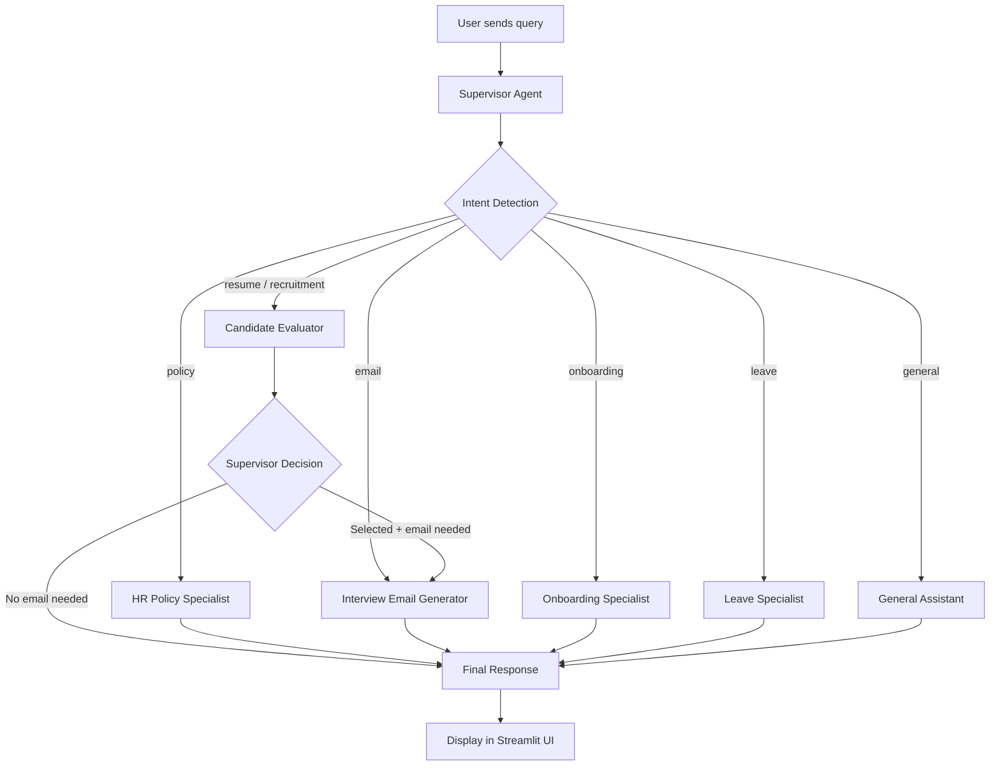

# 🤖 HR Agentic AI

An intelligent, multi-agent HR assistant powered by **LangGraph** and **Google Gemini**. The system uses autonomous AI agents to handle candidate evaluation, HR policy queries, interview email drafting, onboarding tracking, and leave management — all through a conversational Streamlit interface with role-based access control.

---

## ✨ Features

| Feature | Description |
|---|---|
| **🧠 Multi-Agent Orchestration** | A supervisor agent dynamically routes queries to specialized agents via LangGraph state machines |
| **📄 Resume Screening** | Upload candidate resumes (PDF) and get AI-powered evaluation with match scores, scorecards, and interview questions |
| **📚 RAG-Powered Policy Q&A** | Upload employee handbooks and query HR policies using Retrieval-Augmented Generation with ChromaDB |
| **✉️ Interview Email Drafting** | Automatically generate professional interview invitation emails for shortlisted candidates |
| **📋 Onboarding Tracking** | Start, track, and manage onboarding checklists for new hires |
| **🏖️ Leave Management** | Apply for leave, check leave status, and approve/reject leave requests |
| **🔐 Role-Based Access Control** | Three-tier RBAC (HR Admin, HR Manager, Employee) with Supabase authentication |
| **📊 Recruitment Dashboard** | Visual dashboard showing match percentages, recommendations, and agent execution logs |
| **🔄 LLM Fallback** | Primary Gemini 2.5 Flash with automatic fallback to Groq Llama 3.3 70B |

---

## 🏗️ Architecture

```
┌─────────────────────────────────────────────────────────────────┐
│                     Streamlit Frontend                          │
│  (Chat · Knowledge Base · Admin Dashboard · Login)              │
└──────────────────────────┬──────────────────────────────────────┘
                           │
                    ┌──────▼──────┐
                    │  Supervisor  │  ← Intent Detection (LLM + Keyword Fallback)
                    └──────┬──────┘
                           │
          ┌────────────────┼────────────────┬──────────────┐
          │                │                │              │
          ▼                ▼                ▼              ▼
┌─────────────────┐ ┌───────────┐ ┌──────────────┐ ┌──────────┐
│   Candidate     │ │ HR Policy │ │  Onboarding  │ │  Leave   │
│   Evaluator     │ │ Specialist│ │  Specialist  │ │Specialist│
└────────┬────────┘ └─────┬─────┘ └──────┬───────┘ └────┬─────┘
         │                │              │               │
         ▼                │              │               │
┌──────────────────┐      │              │               │
│   Supervisor     │      │              │               │
│   Decision       │      │              │               │
└────────┬─────────┘      │              │               │
         │                │              │               │
         ▼                │              │               │
┌──────────────────┐      │              │               │
│ Interview Email  │      │              │               │
│ Generator        │      │              │               │
└────────┬─────────┘      │              │               │
         │                │              │               │
         └────────────────┼──────────────┼───────────────┘
                          │              │
                   ┌──────▼──────────────▼──┐
                   │     Final Response      │
                   └─────────────────────────┘
```

The system follows a **Supervisor-Worker** pattern:
1. The **Supervisor** classifies user intent using the LLM (with keyword fallback)
2. The query is routed to the appropriate **Specialist Agent**
3. For resume evaluations, a **Supervisor Decision** step determines if an interview email should be drafted
4. All paths converge at the **Final Response** node

---

## 🛠️ Tech Stack

| Layer | Technology |
|---|---|
| **Frontend** | [Streamlit](https://streamlit.io/) |
| **Agent Framework** | [LangChain](https://langchain.com/) + [LangGraph](https://python.langchain.com/v0.1/docs/langgraph/) |
| **Primary LLM** | [Google Gemini 2.5 Flash](https://deepmind.google/technologies/gemini/) |
| **Fallback LLM** | [Groq Llama 3.3 70B](https://groq.com/) |
| **Vector Database** | [ChromaDB](https://www.trychroma.com/) |
| **Embeddings** | [HuggingFace sentence-transformers/all-MiniLM-L6-v2](https://huggingface.co/sentence-transformers/all-MiniLM-L6-v2) |
| **Authentication** | [Supabase Auth](https://supabase.com/auth) |
| **Database** | [Supabase (PostgreSQL)](https://supabase.com/) |
| **PDF Parsing** | [pypdf](https://github.com/py-pdf/pypdf) |
| **Data Validation** | [Pydantic](https://docs.pydantic.dev/) |

---

## 📂 Project Structure

```
hr-agentic-ai/
├── main.py                          # Application entry point & navigation
├── requirements.txt                 # Python dependencies
├── .env                             # Environment variables (not committed)
├── .gitignore
├── data/                            # Sample data files
│   ├── employee_handbook.pdf
│   └── software engineer.pdf
├── vectorstore/                     # ChromaDB persistent storage (auto-generated)
├── uploads/                         # Uploaded file storage
│
├── app/
│   ├── agents/
│   │   ├── graph/
│   │   │   ├── workflow.py          # LangGraph state machine definition
│   │   │   ├── node.py             # Specialist agent node functions
│   │   │   ├── router.py           # Intent detection & classification
│   │   │   └── state.py            # AgentState TypedDict schema
│   │   └── rag/
│   │       ├── build_vectorstore.py # PDF chunking & embedding pipeline
│   │       ├── retriever.py        # ChromaDB retriever setup
│   │       ├── vectorstore.py      # Vector store utilities
│   │       └── loader.py           # Document loader utilities
│   │
│   ├── auth/
│   │   ├── auth_service.py         # Supabase authentication service
│   │   ├── authorization.py        # RBAC authorization middleware
│   │   └── session_manager.py      # Streamlit session management
│   │
│   ├── database/
│   │   ├── supabase_service.py     # Supabase client initialization
│   │   ├── profile_repository.py   # User profile CRUD operations
│   │   └── chat_repository.py      # Chat history persistence
│   │
│   ├── models/
│   │   ├── models.py               # Pydantic models (CandidateEvaluation, LeaveExtraction, etc.)
│   │   └── user.py                 # User, Role, and Profile models
│   │
│   ├── pages/
│   │   ├── login.py                # Login page
│   │   ├── chat.py                 # Main chat interface
│   │   ├── knowledge_base.py       # Knowledge base management
│   │   ├── knowledge_base_types.py # Knowledge base type configuration
│   │   └── admin.py                # Admin dashboard
│   │
│   ├── services/
│   │   ├── knowledge_base.py       # Knowledge base business logic
│   │   └── user_service.py         # User management service
│   │
│   ├── utils/
│   │   ├── config.py               # LLM initialization & environment config
│   │   └── dependencies.py         # Dependency injection setup
│   │
│   └── components/                  # Reusable Streamlit UI components
│
├── database/                        # Database setup scripts
└── setup_supabase.py               # Supabase schema initialization
```

---

## 🚀 Getting Started

### Prerequisites

- **Python 3.10+**
- A [Google AI Studio](https://aistudio.google.com/) API key (for Gemini)
- A [Groq](https://console.groq.com/) API key (for fallback LLM)
- A [Supabase](https://supabase.com/) project (for auth & database)

### 1. Clone the Repository

```bash
git clone https://github.com/your-username/hr-agentic-ai.git
cd hr-agentic-ai
```

### 2. Create a Virtual Environment

```bash
python -m venv venv
source venv/bin/activate   # macOS/Linux
# venv\Scripts\activate    # Windows
```

### 3. Install Dependencies

```bash
pip install -r requirements.txt
```

### 4. Configure Environment Variables

Create a `.env` file in the project root:

```env
GOOGLE_API_KEY=your_google_api_key
GROQ_API_KEY=your_groq_api_key
SUPABASE_URL=your_supabase_project_url
SUPABASE_ANON_KEY=your_supabase_anon_key
SUPABASE_SERVICE_KEY=your_supabase_service_role_key
```

### 5. Set Up Supabase

Run the setup script to initialize the required database tables and schemas:

```bash
python setup_supabase.py
```

### 6. Run the Application

```bash
streamlit run main.py
```

The app will open at `http://localhost:8501`.

---

## 🔄 Workflow

### How a Query is Processed



### Intent Classification

The system uses a **two-tier intent detection** strategy:

1. **Primary**: LLM-based structured output classification using Gemini
2. **Fallback**: Keyword-based pattern matching for robustness

Supported intents: `recruitment` · `resume` · `email` · `policy` · `onboarding` · `leave` · `general`

---

## 👥 Role-Based Access Control

| Capability | HR Admin | HR Manager | Employee |
|---|:---:|:---:|:---:|
| Chat with HR Agent | ✅ | ✅ | ✅ |
| Upload Documents | ✅ | ✅ | ❌ |
| Review Resumes | ✅ | ✅ | ❌ |
| Apply for Leave | ✅ | ✅ | ✅ |
| Approve/Reject Leave | ✅ | ✅ | ❌ |
| Manage Knowledge Base Types | ✅ | ❌ | ❌ |
| Admin Dashboard | ✅ | ❌ | ❌ |
| View System Logs | ✅ | ❌ | ❌ |
| Manage Users | ✅ | ❌ | ❌ |

---

## 📄 Key Models

### CandidateEvaluation

The structured output schema for resume screening:

```python
class CandidateEvaluation(BaseModel):
    candidate_name: str         # Extracted from resume
    match_percentage: int       # 0-100 overall match score
    recommendation: Literal["Selected", "Rejected", "Hold"]
    analysis: str               # 2-4 sentence executive summary
    suggested_questions: List[str]   # Up to 5 interview questions
    scorecard: List[ScorecardItem]   # 3-6 role-specific criteria scores
    final_answer: str           # One-line chat response
```

### LeaveExtraction

```python
class LeaveExtraction(BaseModel):
    leave_type: str             # e.g., "Sick Leave", "Vacation"
    start_date: Optional[str]   # YYYY-MM-DD format
    end_date: Optional[str]     # YYYY-MM-DD format
    reason: Optional[str]       # Extracted from user query
```

---

## 🧩 RAG Pipeline

1. **Upload**: User uploads an Employee Handbook (PDF) via the Knowledge Base page
2. **Parse**: `PyPDFLoader` extracts text from the PDF
3. **Chunk**: Text is split into manageable chunks using LangChain text splitters
4. **Embed**: Chunks are embedded using `sentence-transformers/all-MiniLM-L6-v2`
5. **Store**: Embeddings are persisted in ChromaDB (`vectorstore/` directory)
6. **Retrieve**: When a policy query is detected, relevant chunks are retrieved and passed as context to the LLM

---

## ⚙️ Configuration

### LLM Setup

The system uses a **primary + fallback** LLM strategy:

```python
primary = ChatGoogleGenerativeAI(model="gemini-2.5-flash", temperature=0)
fallback = ChatGroq(model="llama-3.3-70b-versatile", temperature=0)
llm = primary.with_fallbacks([fallback])
```

If the Gemini API is unavailable or rate-limited, the system automatically falls back to Groq's Llama 3.3 70B model.

---

## 🗺️ Roadmap

- [ ] MCP integration for external HR systems (SAP, Workday, BambooHR)
- [ ] Calendar integration for automated interview scheduling
- [ ] Email sending via SMTP/API for interview invitations
- [ ] Real-time salary benchmarking data integration
- [ ] Multi-language support for global HR teams
- [ ] Advanced analytics dashboard with hiring pipeline metrics

---

## 📝 License

This project is for educational and demonstration purposes.

---

<p align="center">
  Built with ❤️ using LangGraph, Google Gemini, and Streamlit
</p>
